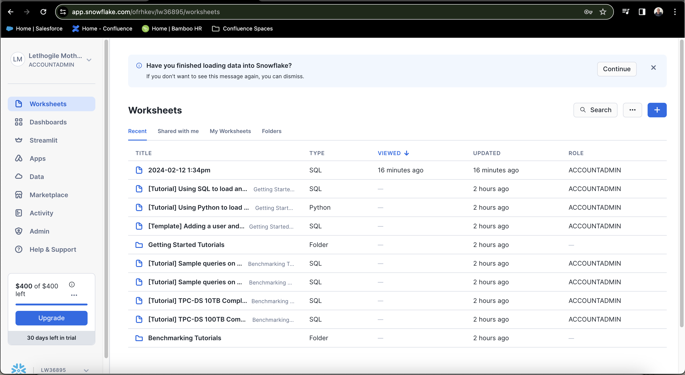
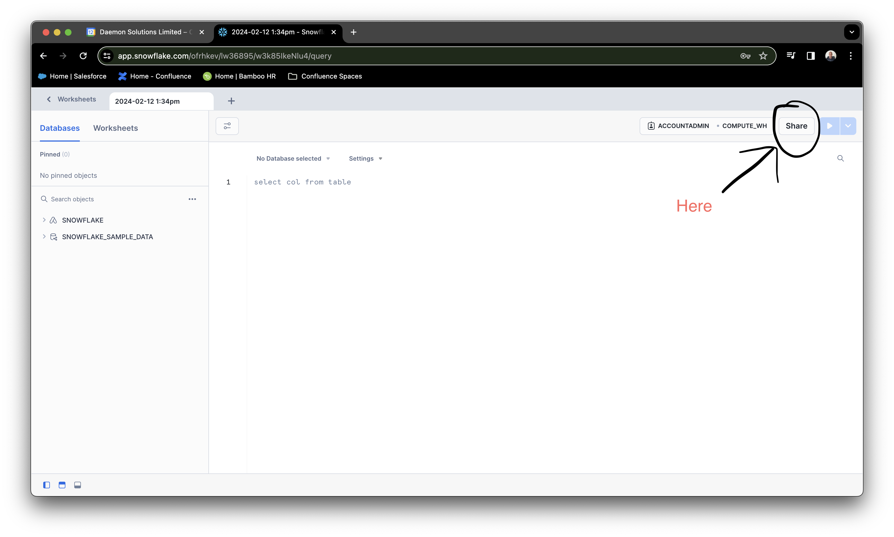
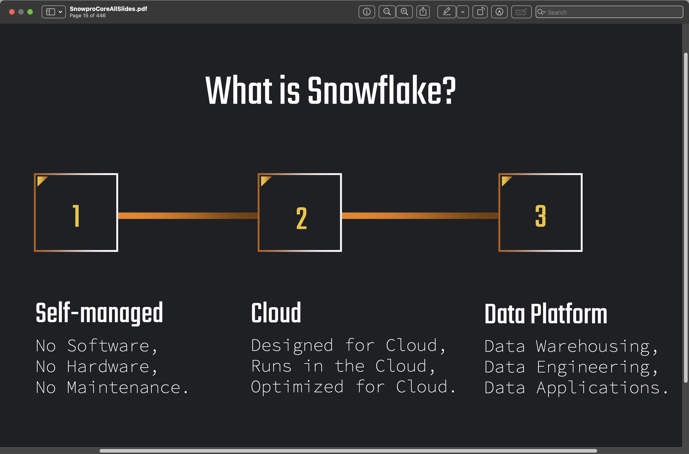

# Section 1: Introduction

## General Notes

1. "Snowsight Interface" refers to the web UI for snowflake
    
    
    
1. Worksheet can be shared using the "Share" button of the worksheets section

    

1. "User" is NOT a valid context to select in a worksheet
    - valid contexts to select
      - role
      - database
      - schema
      - warehuse
   ```snowflake
   use role MY_ROLE;
   use database MY_DATABASE;
   use schema MY_SCHEMA;
   use warehouse MY_WAREHOUSE;
   ```
   
    - invalid contexts to selct
   ```snowflake
   use user MY_USER_NAME;
   ```
   
## Personal Summaries from Slides

1. Snowflake is a self-managed, cloud-native data platform
    

[<- previous](../README.md)