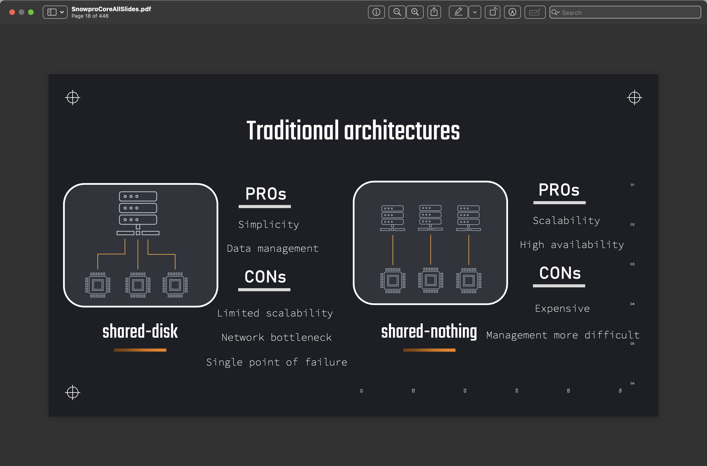
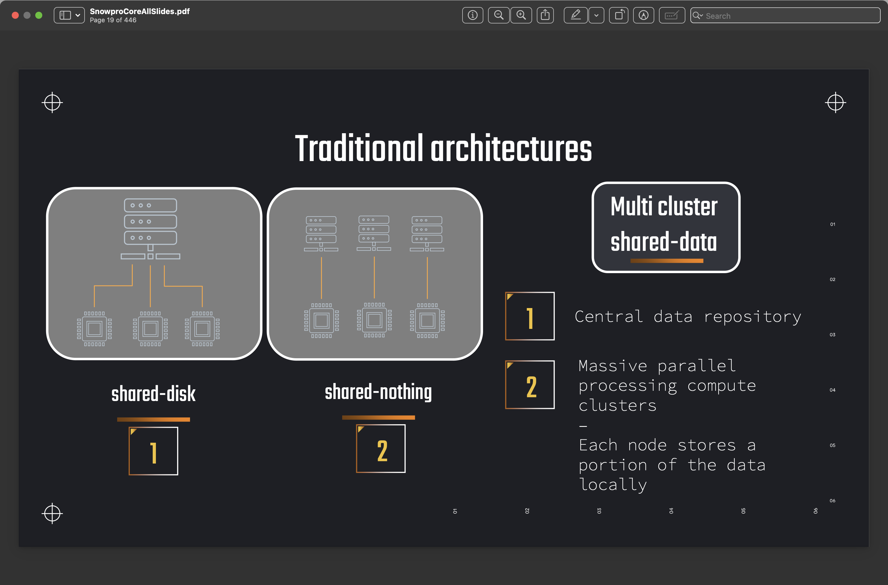
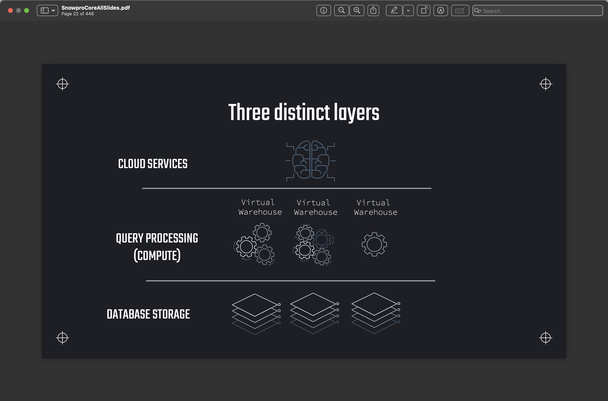
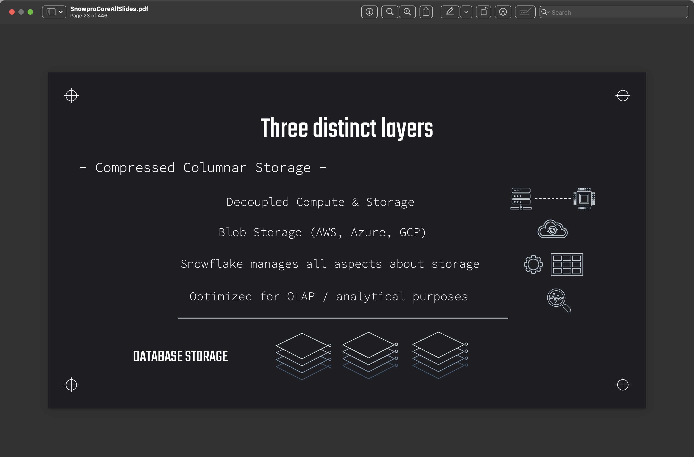
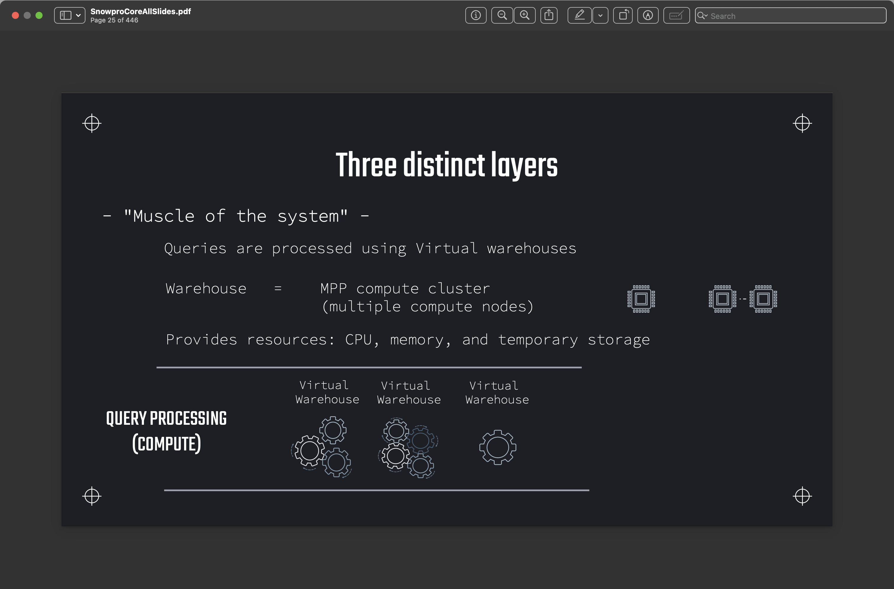
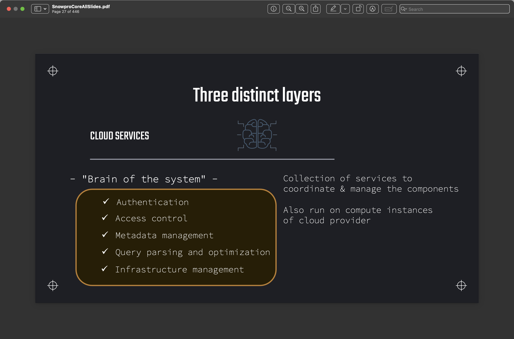

# Section 2 - Part 1: Multi-cluster shared disk and three distinct layers

## Snowflake Architecture: Managing Storage and Compute

- Storage and computation are limited resources
- 2 major approaches emerged as ways of solving problems related to limited storage and computation
    
- Snowflake's Solution is a hybrid these traditional approaches
    

## Snowflake Architecture: Three Distinct Layers

- Snowflake's architecture is comprised of 3 distinct layers. Namely:
  1. Database Storage Layer
  2. Query Processing (Compute) Layer
  3. Cloud Services Layer

    

- The Storage Layer is where the data is stored

    
  
- The query processing layer is where virtual machines [warehouses] perform necessary computation to execute queries

    

- The cloud services layer coordinates the other layers together in a secure, transparent and cost-effective way for users

    
