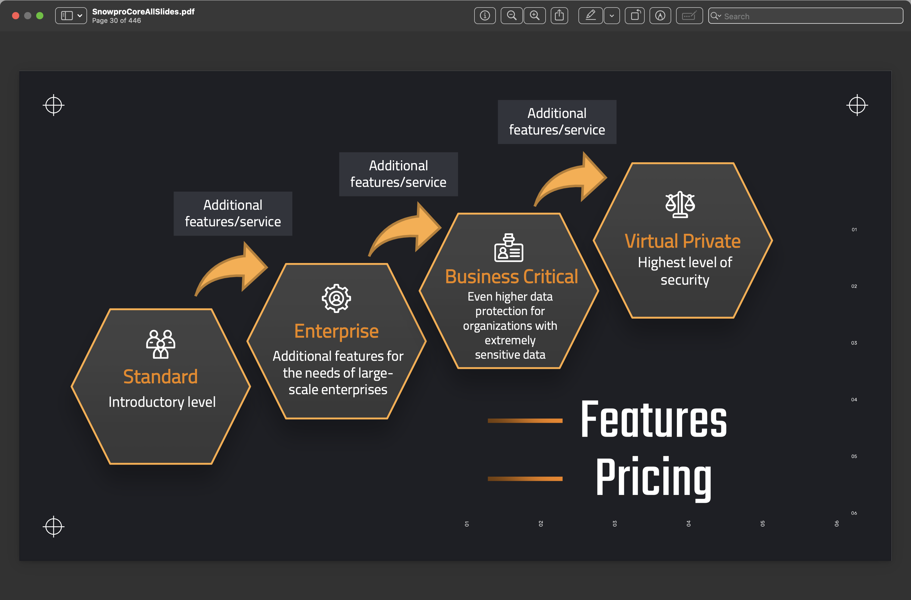
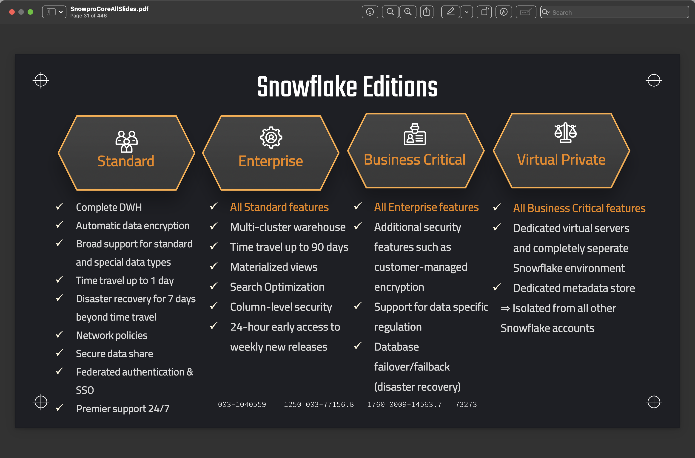

#  Section 2 - Part 2: Snowflake Editions

There are 4 editions of snowflake. Listed below in increasing cost and features:
1. Standard Edition
1. Enterprise Edition
1. Business Critical Edition
1. Virtual Private Edition

The features of each subsequent edition as listed above, builds on the set of features in the previous edition.

e.g The **Enterprise edition** has all the features in the **Standard edition**. So it goes until the **Virtual Private edition** with the most features

[<- previous](README.md)