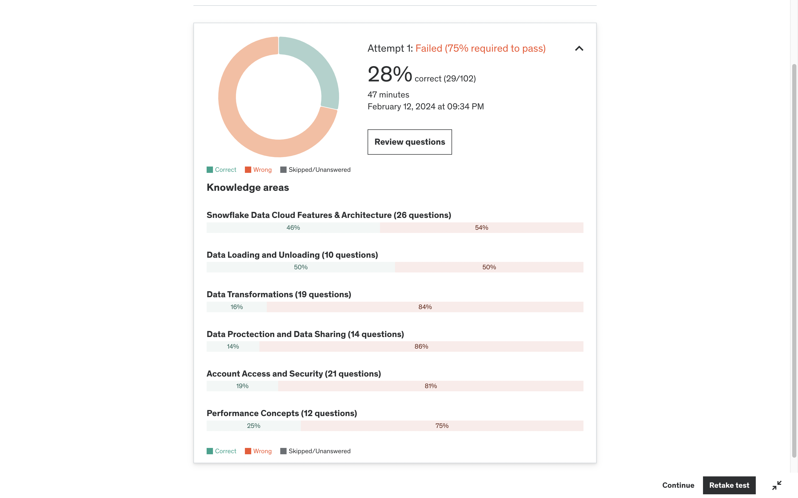

# Corrections for Prep Exam Take 1: 2024-02-13

Here are the results of my first take

Exam corrections were organised into sections, starting with the section I performed the worst in.

1. [Section 8 Correction: Account and Security](correction01section08.md)
1. [Section 4 Correction: Data Transformations](corrections02section04.md)
1. [Section 2 Correction: Architecture](corrections03section02.md)
1. [Section 9 Corrections: Performance Concepts](corrections04section09.md)
1. [Section 7 Corrections: Zero-copy Cloning and Sharing](corrections05section07.md)
1. [Section 3 Corrections: Data Loading and Unloading](corrections06section03.md)
1. [Section 6 Corrections: Continuous Protection](corrections07section06.md)

[<- previous](../README.md)

