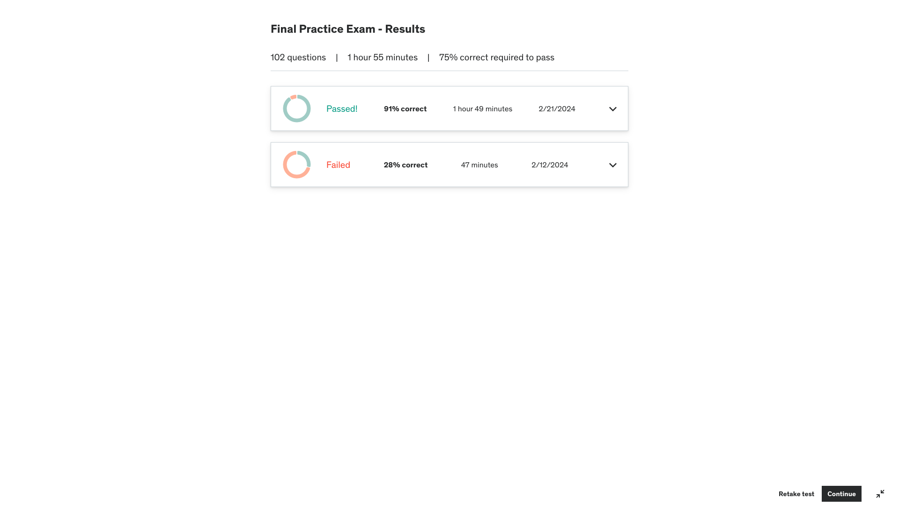

# Corrections for Prep Exam Take 2: 2024-02-22

Here are the results of my second take

Here are the 2 results back to back

Exam corrections were organised into sections, starting with the section I performed the worst in.

1. [Section 8 Correction: Account and Security]()
1. [Section 4 Correction: Data Transformations]()
1. [Section 7 Corrections: Zero-copy Cloning and Sharing]()
1. [Section 9 Corrections: Performance Concepts]()
1. [Section 3 Corrections: Data Loading and Unloading]()
1. [Section 5 Corrections: Additional Snowflake Tools and Connectors]()
1. [Section 2 Correction: Architecture]()
1. [Section 6 Corrections: Continuous Protection]()
